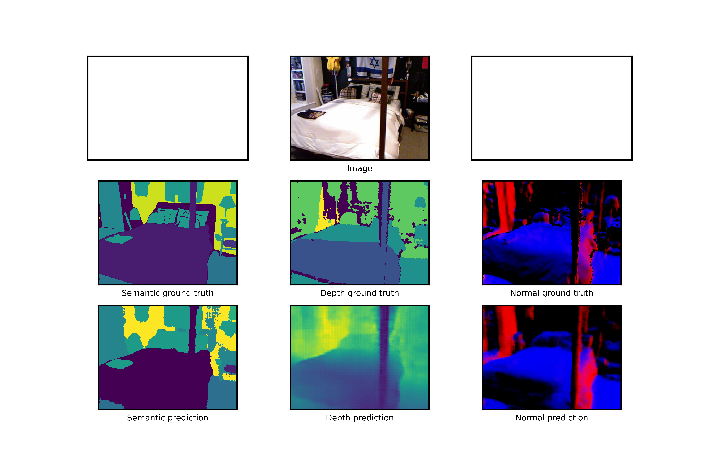
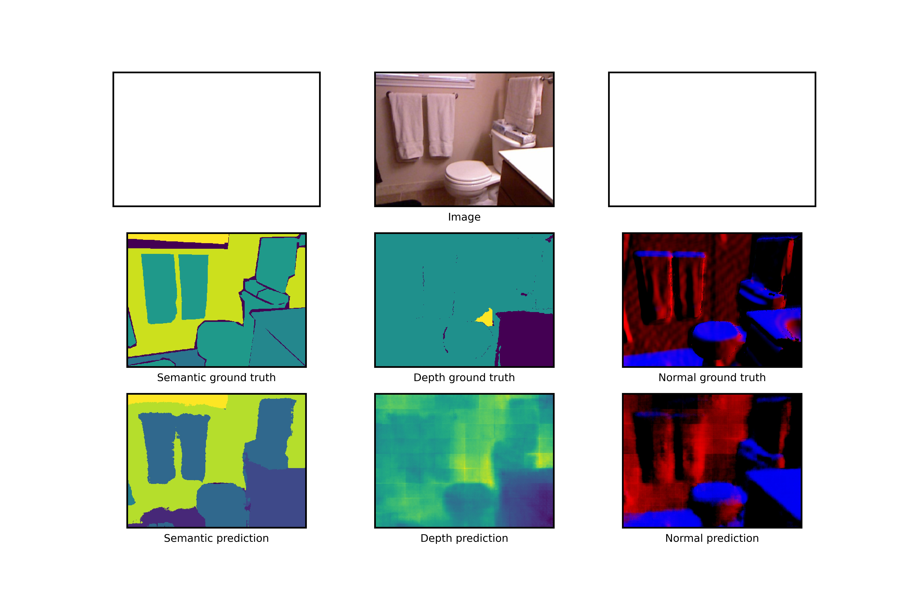

# MultiNet-A-Multitask_leraning-architecture

This repository contains the source code of Multinet.


## Dataset
Download pre-processed `NYUv2` dataset [here](https://www.dropbox.com/sh/86nssgwm6hm3vkb/AACrnUQ4GxpdrBbLjb6n-mWNa?dl=0) which we evaluated in the paper.
Dataroot should be like this:

data  
├───train   
│   ├───depth    
│   ├───image  
│   ├───label  
│   |───normal  
|───val  
    ├───depth  
    ├───image  
    ├───label  
    |───normal  
    


To run any multinet: 
`python3 train_multinet.py --dataroot /data --apply_augmentation --ckpt_dir /ckpt --epochs 200 --batch_size 4 --backbone resnet101 --architecture fcn`

To run SingleNet:
`python3 train_singlenet.py --dataroot /data --apply_augmentation --ckpt_dir /ckpt_dir --epochs 200 --batch_size 4 --backbone resnet101 --task semantic`

## Results
<p align = "center">
    
    <br>
</p>

<p align = "center">
    
    <br>
</p>

## Citation
```
@inproceedings{liu2019end,
  title={End-to-End Multi-task Learning with Attention},
  author={Liu, Shikun and Johns, Edward and Davison, Andrew J},
  booktitle={Proceedings of the IEEE Conference on Computer Vision and Pattern Recognition},
  pages={1871--1880},
  year={2019}
}
```


## Acknowledgement
We would like to thank Prof. Jacob Whitehill for his help on this project.

## Contact
If you have any questions, please contact `kgnandanwar@wpi.edu`.

